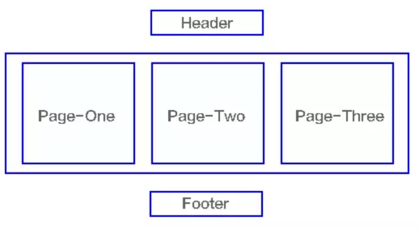

[本文转自**vuejs-tutorial**，尊重原创，点击可直接访问原文](https://vuejs.lipengzhou.com/)

# 第 7 章 Vue Router

## 单页面应用程序

几个比较典型的单页面应用程序网站：

- [网易云音乐](https://music.163.com/)
- [CODING](https://coding.net/)
- 。。。

**单页应用**（英语：single-page application，缩写**SPA**）是一种[网络应用程序](https://zh.wikipedia.org/wiki/网络应用程序)或[网站](https://zh.wikipedia.org/wiki/網站)的模型，它通过动态重写当前页面来与用户交互，而非传统的从服务器重新加载整个新页面。这种方法避免了页面之间切换打断[用户体验](https://zh.wikipedia.org/wiki/用户体验)，使应用程序更像一个[桌面应用程序](https://zh.wikipedia.org/wiki/应用软件)。

单页应用的出现不可考。从 [Wikipedia](https://en.wikipedia.org/wiki/Single-page_application#History) 上可以看到，起源很早，甚至可以追溯到2002年。你可能会说，这不是什么新概念，Google 的 [Gmail](http://tinyambition.com/Single-Page-App-Break/mail.google.com) 就是一个单页应用，可追溯到2004年到2005年。但这个概念火热起来在2010年，Backbone 问世之后。随着后来的 Knockout、Ember.js、AngularJS 的兴起，单页应用开始家喻户晓起来。2015年 React 的出现，Virtual DOM 横扫了各种 MV* 框架，单页应用框架甚至进入到了一个新的时代。目前主流的前端开发框架都可以让你轻松的构建单页面应用程序。

SPA技术将逻辑从服务器转移到了客户端。这导致Web服务器发展为一个纯数据API或Web服务。这种架构的转变在一些圈子中被称为“瘦服务器架构”，以强调复杂性已从服务端转移到客户端，并认为这最终降低了系统的整体复杂性。

下面是单页面应用和传统的多页面应用各自的交互方式：

多页面应用，多页面跳转刷新所有资源：


在传统的网页应用中，浏览器更多的是充当一个展示层，路由处理、服务调用、页面跳转流程都由服务端来处理。即 MVC 都放在服务器端，而 V 作为用户界面则通过网络发送到浏览器端，作为 UI 与用户交互。

这样的范式有以下特点：

- **重服务端**，由于 MVC 都存在于服务器上，因此这类应用在开发资源和开发的重心都偏向后端，往往是后端工程师来主导整个项目开发；
- **页面频繁刷新**，由于浏览器端只是一个展现层，当页面功能有所变化的时，页面就刷新，这会导致资源的浪费，用户需要花费额外的时间等待页面刷新，用户体验不佳。

单页面应用，只有一张Web页面的应用，是一种从Web服务器加载的富客户端，单页面跳转仅刷新局部资源 ，公共资源(js、css等)仅需加载一次：




### 优缺点

优点：

- **增强用户体验**，这个应该是最显著的有点，由于路由分发直接在浏览器端完成，页面是不刷新，对用户的响应非常及时，因此提升了用户体验
- **减轻服务器压力**，服务器只用出数据就可以，不用管展示逻辑和页面合成，吞吐能力会提高几倍
- **完全的前端组件化**，前端开发不再以页面为单位，更多地采用组件化的思想，代码结构和组织方式更加规范化，便于修改和调整
- **良好的前后端分离开发**，前端负责界面显示，后端负责数据存储和计算，各司其职，不会把前后端的逻辑混杂在一起


缺点：

- **不利于 SEO**，单页页面，数据在前端渲染，就意味着没有 SEO，或者需要使用变通的方案
  - 不过目前可以配置服务端渲染来解决这个问题，但还不够足够成熟

- **初次加载耗时相对增多**，要在一个页面上为用户提供产品的所有功能，在这个页面加载的时候，首先要加载大量的静态资源，这个加载时间相对比较长

- **较高的前端开发门槛**，对开发人员技能水平要求较高，不再是『切切图，画画页面这么简单』
- 低版本浏览器兼容差


### 单页面导航路径

- 概念
- 路径
  - 一般使用锚点，也就是 hash 作为页面导航的路径标识
  - 为什么？因为正常的 url 地址会发请求，而 hash 锚点不会发请求刷新页面
- VueRouter 内部监视了 hash 的改变
  - window.onhashchange
- 然后根据 hash 的改变去展示路由规则中配置的组件
- Vue Router 默认要求 hash 导航路径都以 #/ 开头
  - 为什么？
  - 主要是为了和正常的 hash 锚点（网页内部定位，id）作区别
  - 例如我们使用锚点内部定位的时候，需要给元素起 id，我们几乎不会给这个 id 起名为 /xxx
  - 如果 VueRouter 没有 #/ 的规则，例如直接 #foo 就可能会和你锚点的那个 id foo 冲突。

有人会说，能不能让 url 漂亮点儿，不要使用 hash 呢？

可以。

我们可以利用 HTML5 history 的的方式使用传统的 url。（我们可以用 JavaScript 代码控制 url）。

- VueRouter 默认是 hash 路径模式
- 它也支持传统的 url 模式（HTML5 history）https://router.vuejs.org/zh/guide/#html
  - 需要额外的服务器配置

### 工作原理

- [HTML5 History API](https://developer.mozilla.org/zh-CN/docs/Web/API/History_API)
  - 优雅
  - 同构应用友好
- Hash
  - 兼容性好

#### History API

- onpopstate 响应历史记录改变的一个事件
- pushState 创建历史记录
- 前进，后退，控制


一共两个需求：

- 执行打开页面的操作
- 历史操作记录


#### Hash

- hashchange
- location.hash


## 安装

### 直接下载 / CDN

<https://unpkg.com/vue-router/dist/vue-router.js>

在 Vue 后面加载 vue-router，它会自动安装的：

```html
<script src="/path/to/vue.js"></script>
<script src="/path/to/vue-router.js"></script>
```

### NPM

```bash
npm install vue-router
```

如果在一个模块化工程中使用它，必须要通过 `Vue.use()` 明确地安装路由功能：

```js
import Vue from 'vue'
import VueRouter from 'vue-router'

Vue.use(VueRouter)
```

如果使用全局的 script 标签，则无须如此 (手动安装)。


## Hello World

用 Vue.js + Vue Router 创建单页应用，是非常简单的。使用 Vue.js ，我们已经可以通过组合组件来组成应用程序，当你要把 Vue Router 添加进来，我们需要做的是，将组件 (components) 映射到路由 (routes)，然后告诉 Vue Router 在哪里渲染它们。下面是个基本例子：

```html
<script src="https://unpkg.com/vue/dist/vue.js"></script>
<script src="https://unpkg.com/vue-router/dist/vue-router.js"></script>

<div id="app">
  <h1>Hello App!</h1>
  <p>
    <!-- 使用 router-link 组件来导航. -->
    <!-- 通过传入 `to` 属性指定链接. -->
    <!-- <router-link> 默认会被渲染成一个 `<a>` 标签 -->
    <router-link to="/foo">Go to Foo</router-link>
    <router-link to="/bar">Go to Bar</router-link>
  </p>
  <!-- 路由出口 -->
  <!-- 路由匹配到的组件将渲染在这里 -->
  <router-view></router-view>
</div>
```

```js
// 0. 如果使用模块化机制编程，导入Vue和VueRouter，要调用 Vue.use(VueRouter)

// 1. 定义 (路由) 组件。
// 可以从其他文件 import 进来
const Foo = { template: '<div>foo</div>' }
const Bar = { template: '<div>bar</div>' }

// 2. 定义路由
// 每个路由应该映射一个组件。 其中"component" 可以是
// 通过 Vue.extend() 创建的组件构造器，
// 或者，只是一个组件配置对象。
// 我们晚点再讨论嵌套路由。
const routes = [
  { path: '/foo', component: Foo },
  { path: '/bar', component: Bar }
]

// 3. 创建 router 实例，然后传 `routes` 配置
// 你还可以传别的配置参数, 不过先这么简单着吧。
const router = new VueRouter({
  routes // (缩写) 相当于 routes: routes
})

// 4. 创建和挂载根实例。
// 记得要通过 router 配置参数注入路由，
// 从而让整个应用都有路由功能
const app = new Vue({
  router
}).$mount('#app')

// 现在，应用已经启动了！
```

## 动态路由匹配

> https://router.vuejs.org/zh/guide/essentials/dynamic-matching.html

---

## 嵌套路由

> https://router.vuejs.org/zh/guide/essentials/nested-routes.html

---

## 编程式导航

> https://router.vuejs.org/zh/guide/essentials/navigation.html

---

## 命名路由

---

## 命名视图

---

## 重定向和别名

---

## 相关 API

### 路由对象 this.\$route

一个**路由对象 (route object)** 表示当前激活的路由的状态信息，包含了当前 URL 解析得到的信息，还有 URL 匹配到的**路由记录 (route records)**。

路由对象是不可变 (immutable) 的，每次成功的导航后都会产生一个新的对象。

路由对象出现在多个地方:

- 在组件内，即 `this.$route`
- 在 `$route` 观察者回调内
- `router.match(location)` 的返回值

- **\$route.path**

  - 类型: `string`

    字符串，对应当前路由的路径，总是解析为绝对路径，如 `"/foo/bar"`。

- **\$route.params**

  - 类型: `Object`

    一个 key/value 对象，包含了动态片段和全匹配片段，如果没有路由参数，就是一个空对象。

- **\$route.query**

  - 类型: `Object`

    一个 key/value 对象，表示 URL 查询参数。例如，对于路径 `/foo?user=1`，则有 `$route.query.user == 1`，如果没有查询参数，则是个空对象。

- **\$route.hash**

  - 类型: `string`

    当前路由的 hash 值 (带 `#`) ，如果没有 hash 值，则为空字符串。

- **\$route.fullPath**

  - 类型: `string`

    完成解析后的 URL，包含查询参数和 hash 的完整路径。

- **\$route.matched**

  - 类型: `Array<RouteRecord>`

  一个数组，包含当前路由的所有嵌套路径片段的**路由记录** 。路由记录就是 `routes` 配置数组中的对象副本 (还有在 `children` 数组)。

  ```js
  const router = new VueRouter({
    routes: [
      // 下面的对象就是路由记录
      {
        path: '/foo',
        component: Foo,
        children: [
          // 这也是个路由记录
          { path: 'bar', component: Bar }
        ]
      }
    ]
  })
  ```

  当 URL 为 `/foo/bar`，`$route.matched` 将会是一个包含从上到下的所有对象 (副本)。

- **\$route.name**

  当前路由的名称，如果有的话。(查看[命名路由](https://router.vuejs.org/zh/guide/essentials/named-routes.html))

- **\$route.redirectedFrom**

  如果存在重定向，即为重定向来源的路由的名字。(参阅[重定向和别名](https://router.vuejs.org/zh/guide/essentials/redirect-and-alias.html))

### Router 实例

> 我们在组件中访问的 this.\$router 就是路由文件中创建的路由实例

| API     | 作用                 | 备注                                                                                                                                           |
| ------- | -------------------- | ---------------------------------------------------------------------------------------------------------------------------------------------- |
| push    | 跳转，会形成历史记录 | 想要导航到不同的 URL，则使用 `router.push` 方法。这个方法会向 history 栈添加一个新的记录，所以，当用户点击浏览器后退按钮时，则回到之前的 URL。 |
| replace | 路径替换             | 跳过去，别回来了                                                                                                                               |
| go      | 跳转到指定步骤的路由 |                                                                                                                                                |
| back    | 后退一步             |                                                                                                                                                |
| forward | 前进一步             |                                                                                                                                                |
|         |                      |                                                                                                                                                |
