#  0.学习目标

- 会配置Hystix熔断
- 会使用Feign进行远程调用
- 能独立搭建Zuul网关
- 能编写Zuul的过滤器


# 1.Hystrix

## 1.1.简介

Hystrix,英文意思是豪猪，全身是刺，看起来就不好惹，是一种保护机制。

Hystrix也是Netflix公司的一款组件。

主页：https://github.com/Netflix/Hystrix/


那么Hystix的作用是什么呢？具体要保护什么呢？

Hystix是Netflix开源的一个延迟和容错库，用于隔离访问远程服务、第三方库，防止出现级联失败。


## 1.2.雪崩问题

微服务中，服务间调用关系错综复杂，一个请求，可能需要调用多个微服务接口才能实现，会形成非常复杂的调用链路：

 

如图，一次业务请求，需要调用A、P、H、I四个服务，这四个服务又可能调用其它服务。

如果此时，某个服务出现异常：

 

例如微服务I发生异常，请求阻塞，用户不会得到响应，则tomcat的这个线程不会释放，于是越来越多的用户请求到来，越来越多的线程会阻塞：

 

服务器支持的线程和并发数有限，请求一直阻塞，会导致服务器资源耗尽，从而导致所有其它服务都不可用，形成雪崩效应。

这就好比，一个汽车生产线，生产不同的汽车，需要使用不同的零件，如果某个零件因为种种原因无法使用，那么就会造成整台车无法装配，陷入等待零件的状态，直到零件到位，才能继续组装。  此时如果有很多个车型都需要这个零件，那么整个工厂都将陷入等待的状态，导致所有生产都陷入瘫痪。一个零件的波及范围不断扩大。 


Hystix解决雪崩问题的手段有两个：

- 线程隔离
- 服务熔断


## 1.3.线程隔离，服务降级

### 1.3.1.原理

线程隔离示意图：

 

解读：

Hystrix为每个依赖服务调用分配一个小的线程池，如果线程池已满调用将被立即拒绝，默认不采用排队.加速失败判定时间。

用户的请求将不再直接访问服务，而是通过线程池中的空闲线程来访问服务，如果**线程池已满**，或者**请求超时**，则会进行降级处理，什么是服务降级？

> 服务降级：优先保证核心服务，而非核心服务不可用或弱可用。

用户的请求故障时，不会被阻塞，更不会无休止的等待或者看到系统崩溃，至少可以看到一个执行结果（例如返回友好的提示信息） 。

服务降级虽然会导致请求失败，但是不会导致阻塞，而且最多会影响这个依赖服务对应的线程池中的资源，对其它服务没有响应。

触发Hystix服务降级的情况：

- 线程池已满
- 请求超时


### 1.3.2.动手实践

#### 1.3.2.1.引入依赖

首先在itcast-service-consumer的pom.xml中引入Hystrix依赖：

```xml
<dependency>
    <groupId>org.springframework.cloud</groupId>
    <artifactId>spring-cloud-starter-netflix-hystrix</artifactId>
</dependency>
```


#### 1.3.2.2.开启熔断


可以看到，我们类上的注解越来越多，在微服务中，经常会引入上面的三个注解，于是Spring就提供了一个组合注解：@SpringCloudApplication


因此，我们可以使用这个组合注解来代替之前的3个注解。

```java
@SpringCloudApplication
public class ItcastServiceConsumerApplication {

    @Bean
    @LoadBalanced
    public RestTemplate restTemplate(){
        return new RestTemplate();
    }

    public static void main(String[] args) {
        SpringApplication.run(ItcastServiceConsumerApplication.class, args);
    }
}
```


#### 1.3.2.3.编写降级逻辑

我们改造itcast-service-consumer，当目标服务的调用出现故障，我们希望快速失败，给用户一个友好提示。因此需要提前编写好失败时的降级处理逻辑，要使用HystixCommond来完成：

```java
@Controller
@RequestMapping("consumer/user")
public class UserController {

    @Autowired
    private RestTemplate restTemplate;

    @GetMapping
    @ResponseBody
    @HystrixCommand(fallbackMethod = "queryUserByIdFallBack")
    public String queryUserById(@RequestParam("id") Long id) {
        String user = this.restTemplate.getForObject("http://service-provider/user/" + id, String.class);
        return user;
    }

    public String queryUserByIdFallBack(Long id){
        return "请求繁忙，请稍后再试！";
    }
}
```

要注意，因为熔断的降级逻辑方法必须跟正常逻辑方法保证：**相同的参数列表和返回值声明**。失败逻辑中返回User对象没有太大意义，一般会返回友好提示。所以我们把queryById的方法改造为返回String，反正也是Json数据。这样失败逻辑中返回一个错误说明，会比较方便。

说明：

- @HystrixCommand(fallbackMethod = "queryByIdFallBack")：用来声明一个降级逻辑的方法

测试：

当itcast-service-provder正常提供服务时，访问与以前一致。但是当我们将itcast-service-provider停机时，会发现页面返回了降级处理信息：


#### 1.3.2.4.默认FallBack

我们刚才把fallback写在了某个业务方法上，如果这样的方法很多，那岂不是要写很多。所以我们可以把Fallback配置加在类上，实现默认fallback：

```java
@Controller
@RequestMapping("consumer/user")
@DefaultProperties(defaultFallback = "fallBackMethod") // 指定一个类的全局熔断方法
public class UserController {

    @Autowired
    private RestTemplate restTemplate;

    @GetMapping
    @ResponseBody
    @HystrixCommand // 标记该方法需要熔断
    public String queryUserById(@RequestParam("id") Long id) {
        String user = this.restTemplate.getForObject("http://service-provider/user/" + id, String.class);
        return user;
    }

    /**
     * 熔断方法
     * 返回值要和被熔断的方法的返回值一致
     * 熔断方法不需要参数
     * @return
     */
    public String fallBackMethod(){
        return "请求繁忙，请稍后再试！";
    }
}
```

- @DefaultProperties(defaultFallback = "defaultFallBack")：在类上指明统一的失败降级方法
- @HystrixCommand：在方法上直接使用该注解，使用默认的剪辑方法。
- defaultFallback：默认降级方法，不用任何参数，以匹配更多方法，但是返回值一定一致


#### 1.3.2.5.设置超时

在之前的案例中，请求在超过1秒后都会返回错误信息，这是因为Hystix的默认超时时长为1，我们可以通过配置修改这个值：

我们可以通过`hystrix.command.default.execution.isolation.thread.timeoutInMilliseconds`来设置Hystrix超时时间。该配置没有提示。

```yaml
hystrix:
  command:
    default:
      execution:
        isolation:
          thread:
            timeoutInMilliseconds: 6000 # 设置hystrix的超时时间为6000ms
```

**改造服务提供者**

改造服务提供者的UserController接口，随机休眠一段时间，以触发熔断：

```java
@GetMapping("{id}")
public User queryUserById(@PathVariable("id") Long id) {
    try {
        Thread.sleep(6000);
    } catch (InterruptedException e) {
        e.printStackTrace();
    }
    return this.userService.queryUserById(id);
}
```


## 1.4.服务熔断

### 1.4.1.熔断原理

熔断器，也叫断路器，其英文单词为：Circuit Breaker 


熔断状态机3个状态：

- Closed：关闭状态，所有请求都正常访问。
- Open：打开状态，所有请求都会被降级。Hystix会对请求情况计数，当一定时间内失败请求百分比达到阈值，则触发熔断，断路器会完全打开。默认失败比例的阈值是50%，请求次数最少不低于20次。
- Half Open：半开状态，open状态不是永久的，打开后会进入休眠时间（默认是5S）。随后断路器会自动进入半开状态。此时会释放部分请求通过，若这些请求都是健康的，则会完全关闭断路器，否则继续保持打开，再次进行休眠计时


### 1.4.2.动手实践

为了能够精确控制请求的成功或失败，我们在consumer的调用业务中加入一段逻辑：

```java
@GetMapping("{id}")
@HystrixCommand
public String queryUserById(@PathVariable("id") Long id){
    if(id == 1){
        throw new RuntimeException("太忙了");
    }
    String user = this.restTemplate.getForObject("http://service-provider/user/" + id, String.class);
    return user;
}
```

这样如果参数是id为1，一定失败，其它情况都成功。（不要忘了清空service-provider中的休眠逻辑）

我们准备两个请求窗口：

- 一个请求：http://localhost/consumer/user/1，注定失败
- 一个请求：http://localhost/consumer/user/2，肯定成功

当我们疯狂访问id为1的请求时（超过20次），就会触发熔断。断路器会断开，一切请求都会被降级处理。

此时你访问id为2的请求，会发现返回的也是失败，而且失败时间很短，只有几毫秒左右：

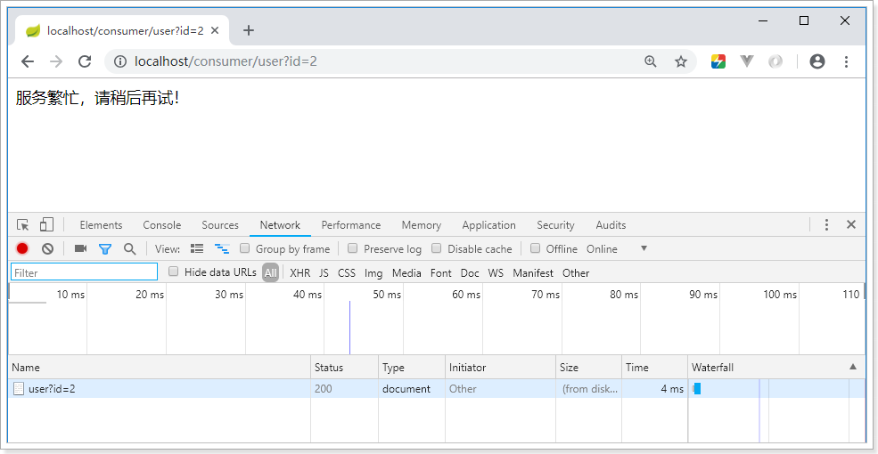


不过，默认的熔断触发要求较高，休眠时间窗较短，为了测试方便，我们可以通过配置修改熔断策略：

```properties
circuitBreaker.requestVolumeThreshold=10
circuitBreaker.sleepWindowInMilliseconds=10000
circuitBreaker.errorThresholdPercentage=50
```

解读：

- requestVolumeThreshold：触发熔断的最小请求次数，默认20
- errorThresholdPercentage：触发熔断的失败请求最小占比，默认50%
- sleepWindowInMilliseconds：休眠时长，默认是5000毫秒


# 2.Feign

在前面的学习中，我们使用了Ribbon的负载均衡功能，大大简化了远程调用时的代码：

```java
String user = this.restTemplate.getForObject("http://service-provider/user/" + id, String.class);
```

如果就学到这里，你可能以后需要编写类似的大量重复代码，格式基本相同，无非参数不一样。有没有更优雅的方式，来对这些代码再次优化呢？

这就是我们接下来要学的Feign的功能了。


## 2.1.简介

有道词典的英文解释：

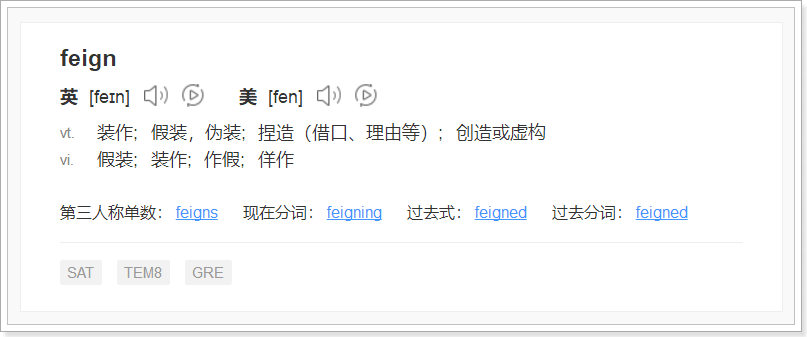

为什么叫伪装？

Feign可以把Rest的请求进行隐藏，伪装成类似SpringMVC的Controller一样。你不用再自己拼接url，拼接参数等等操作，一切都交给Feign去做。


项目主页：https://github.com/OpenFeign/feign


## 2.2.快速入门

改造itcast-service-consumer工程

### 2.2.1.导入依赖

```xml
<dependency>
    <groupId>org.springframework.cloud</groupId>
    <artifactId>spring-cloud-starter-openfeign</artifactId>
</dependency>
```


### 2.2.2.开启Feign功能

我们在启动类上，**添加注解**，开启Feign功能

```java
@SpringCloudApplication
@EnableFeignClients // 开启feign客户端
public class ItcastServiceConsumerApplication {
    
    public static void main(String[] args) {
        SpringApplication.run(ItcastServiceConsumerApplication.class, args);
    }
}
```

**删除RestTemplate**：feign已经自动集成了Ribbon负载均衡的RestTemplate。所以，此处不需要再注册RestTemplate。


### 2.2.3.Feign的客户端

在itcast-service-consumer工程中，添加UserClient接口：

 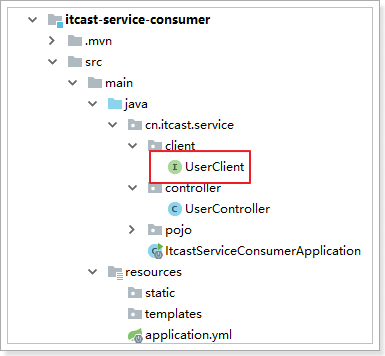

内容：

```java
@FeignClient(value = "service-provider") // 标注该类是一个feign接口
public interface UserClient {

    @GetMapping("user/{id}")
    User queryById(@PathVariable("id") Long id);
}
```

- 首先这是一个接口，Feign会通过动态代理，帮我们生成实现类。这点跟mybatis的mapper很像
- `@FeignClient`，声明这是一个Feign客户端，类似`@Mapper`注解。同时通过`value`属性指定服务名称
- 接口中的定义方法，完全采用SpringMVC的注解，Feign会根据注解帮我们生成URL，并访问获取结果

改造原来的调用逻辑，调用UserClient接口：

```java
@Controller
@RequestMapping("consumer/user")
public class UserController {

    @Autowired
    private UserClient userClient;

    @GetMapping
    @ResponseBody
    public User queryUserById(@RequestParam("id") Long id){
        User user = this.userClient.queryUserById(id);
        return user;
    }

}
```


### 2.2.4.启动测试

访问接口： 


正常获取到了结果。


## 2.3.负载均衡

Feign中本身已经集成了Ribbon依赖和自动配置：

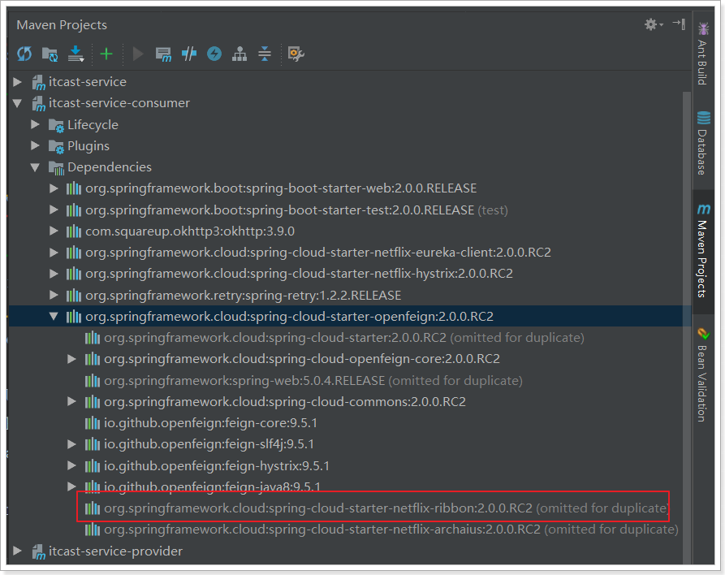

因此我们不需要额外引入依赖，也不需要再注册`RestTemplate`对象。


## 2.4.Hystrix支持

Feign默认也有对Hystrix的集成：


只不过，默认情况下是关闭的。我们需要通过下面的参数来开启：(在itcast-service-consumer工程添加配置内容)

```yaml
feign:
  hystrix:
    enabled: true # 开启Feign的熔断功能
```

但是，Feign中的Fallback配置不像hystrix中那样简单了。

1）首先，我们要定义一个类UserClientFallback，实现刚才编写的UserClient，作为fallback的处理类

 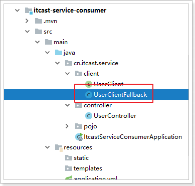

```java
@Component
public class UserClientFallback implements UserClient {

    @Override
    public User queryById(Long id) {
        User user = new User();
        user.setUserName("服务器繁忙，请稍后再试！");
        return user;
    }
}
```

2）然后在UserFeignClient中，指定刚才编写的实现类

```java
@FeignClient(value = "service-provider", fallback = UserClientFallback.class) // 标注该类是一个feign接口
public interface UserClient {

    @GetMapping("user/{id}")
    User queryUserById(@PathVariable("id") Long id);
}
```

3）重启测试：


## 2.5.请求压缩(了解)

Spring Cloud Feign 支持对请求和响应进行GZIP压缩，以减少通信过程中的性能损耗。通过下面的参数即可开启请求与响应的压缩功能：

```yaml
feign:
  compression:
    request:
      enabled: true # 开启请求压缩
    response:
      enabled: true # 开启响应压缩
```

同时，我们也可以对请求的数据类型，以及触发压缩的大小下限进行设置：

```yaml
feign:
  compression:
    request:
      enabled: true # 开启请求压缩
      mime-types: text/html,application/xml,application/json # 设置压缩的数据类型
      min-request-size: 2048 # 设置触发压缩的大小下限
```

注：上面的数据类型、压缩大小下限均为默认值。


## 2.6.日志级别(了解)

前面讲过，通过`logging.level.xx=debug`来设置日志级别。然而这个对Fegin客户端而言不会产生效果。因为`@FeignClient`注解修改的客户端在被代理时，都会创建一个新的Fegin.Logger实例。我们需要额外指定这个日志的级别才可以。

1）设置com.leyou包下的日志级别都为debug

```yaml
logging:
  level:
    cn.itcast: debug
```

2）编写配置类，定义日志级别

 

内容：

```java
@Configuration
public class FeignLogConfiguration {

    @Bean
    Logger.Level feignLoggerLevel(){
        return Logger.Level.FULL;
    }
}
```

这里指定的Level级别是FULL，Feign支持4种级别：

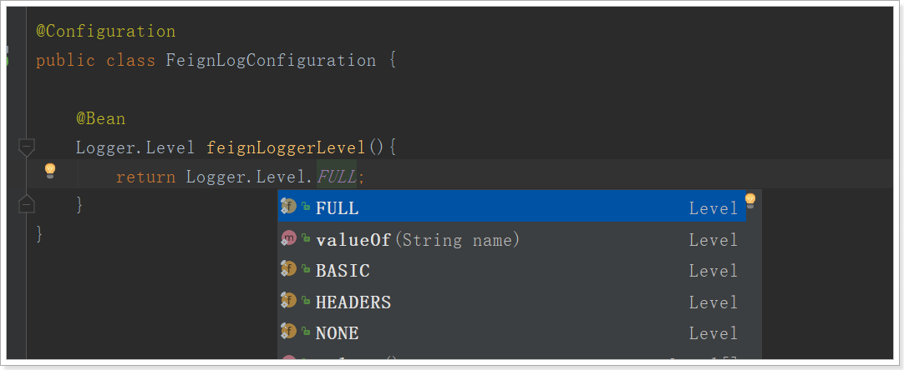

- NONE：不记录任何日志信息，这是默认值。
- BASIC：仅记录请求的方法，URL以及响应状态码和执行时间
- HEADERS：在BASIC的基础上，额外记录了请求和响应的头信息
- FULL：记录所有请求和响应的明细，包括头信息、请求体、元数据。


3）在FeignClient中指定配置类：

```java
@FeignClient(value = "service-privider", fallback = UserFeignClientFallback.class, configuration = FeignConfig.class)
public interface UserFeignClient {
    @GetMapping("/user/{id}")
    User queryUserById(@PathVariable("id") Long id);
}
```

4）重启项目，即可看到每次访问的日志：


# 3.Zuul网关

通过前面的学习，使用Spring Cloud实现微服务的架构基本成型，大致是这样的：


	我们使用Spring Cloud Netflix中的Eureka实现了服务注册中心以及服务注册与发现；而服务间通过Ribbon或Feign实现服务的消费以及均衡负载。为了使得服务集群更为健壮，使用Hystrix的融断机制来避免在微服务架构中个别服务出现异常时引起的故障蔓延。
	
	在该架构中，我们的服务集群包含：内部服务Service A和Service B，他们都会注册与订阅服务至Eureka Server，而Open Service是一个对外的服务，通过均衡负载公开至服务调用方。我们把焦点聚集在对外服务这块，直接暴露我们的服务地址，这样的实现是否合理，或者是否有更好的实现方式呢？


先来说说这样架构需要做的一些事儿以及存在的不足：

- 破坏了服务无状态特点。

  	为了保证对外服务的安全性，我们需要实现对服务访问的权限控制，而开放服务的权限控制机制将会贯穿并污染整个开放服务的业务逻辑，这会带来的最直接问题是，破坏了服务集群中REST API无状态的特点。

    	从具体开发和测试的角度来说，在工作中除了要考虑实际的业务逻辑之外，还需要额外考虑对接口访问的控制处理。
- 无法直接复用既有接口。

  	当我们需要对一个即有的集群内访问接口，实现外部服务访问时，我们不得不通过在原有接口上增加校验逻辑，或增加一个代理调用来实现权限控制，无法直接复用原有的接口。


面对类似上面的问题，我们要如何解决呢？答案是：服务网关！


为了解决上面这些问题，我们需要将权限控制这样的东西从我们的服务单元中抽离出去，而最适合这些逻辑的地方就是处于对外访问最前端的地方，我们需要一个更强大一些的均衡负载器的 服务网关。

 

服务网关是微服务架构中一个不可或缺的部分。通过服务网关统一向外系统提供REST API的过程中，除了具备`服务路由`、`均衡负载`功能之外，它还具备了`权限控制`等功能。Spring Cloud Netflix中的Zuul就担任了这样的一个角色，为微服务架构提供了前门保护的作用，同时将权限控制这些较重的非业务逻辑内容迁移到服务路由层面，使得服务集群主体能够具备更高的可复用性和可测试性。


## 3.1.简介

官网：https://github.com/Netflix/zuul

 

Zuul：维基百科

电影《捉鬼敢死队》中的怪兽，Zuul，在纽约引发了巨大骚乱。

事实上，在微服务架构中，Zuul就是守门的大Boss！一夫当关，万夫莫开！


## 3.2.Zuul加入后的架构

 

不管是来自于客户端（PC或移动端）的请求，还是服务内部调用。一切对服务的请求都会经过Zuul这个网关，然后再由网关来实现 鉴权、动态路由等等操作。Zuul就是我们服务的统一入口。


## 3.3.快速入门

### 3.3.1.新建工程

填写基本信息：

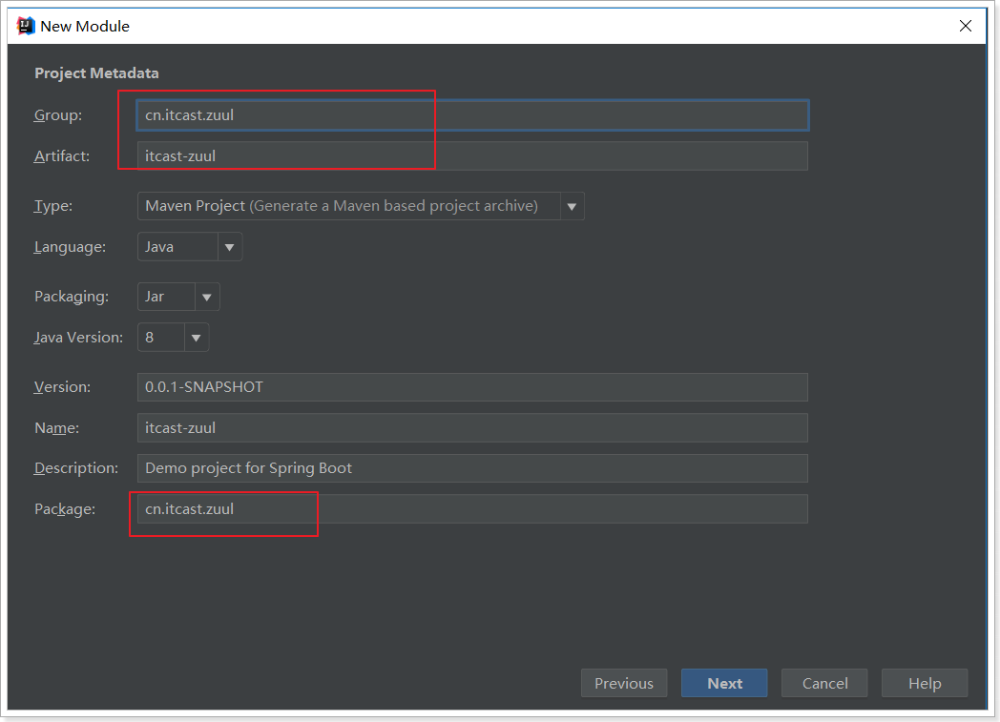

添加Zuul依赖：


### 3.3.2.编写配置

```yaml
server:
  port: 10010 #服务端口
spring:
  application:
    name: api-gateway #指定服务名
```


### 3.3.3.编写引导类

通过`@EnableZuulProxy `注解开启Zuul的功能：

```java
@SpringBootApplication
@EnableZuulProxy // 开启网关功能
public class ItcastZuulApplication {

    public static void main(String[] args) {
        SpringApplication.run(ItcastZuulApplication.class, args);
    }
}
```


### 3.3.4.编写路由规则

我们需要用Zuul来代理service-provider服务，先看一下控制面板中的服务状态：


- ip为：127.0.0.1
- 端口为：8081

映射规则：

```yaml
server:
  port: 10010 #服务端口
spring:
  application:
    name: api-gateway #指定服务名
zuul:
  routes:
    service-provider: # 这里是路由id，随意写
      path: /service-provider/** # 这里是映射路径
      url: http://127.0.0.1:8081 # 映射路径对应的实际url地址
```

我们将符合`path` 规则的一切请求，都代理到 `url`参数指定的地址

本例中，我们将 `/service-provider/**`开头的请求，代理到http://127.0.0.1:8081


### 3.3.5.启动测试

访问的路径中需要加上配置规则的映射路径，我们访问：http://127.0.0.1:10010/service-provider/user/1


## 3.4.面向服务的路由

在刚才的路由规则中，我们把路径对应的服务地址写死了！如果同一服务有多个实例的话，这样做显然就不合理了。我们应该根据服务的名称，去Eureka注册中心查找 服务对应的所有实例列表，然后进行动态路由才对！

对itcast-zuul工程修改优化：

### 3.4.1.添加Eureka客户端依赖

```xml
<dependency>
    <groupId>org.springframework.cloud</groupId>
    <artifactId>spring-cloud-starter-netflix-eureka-client</artifactId>
</dependency>
```


### 3.4.2.添加Eureka配置，获取服务信息

```yaml
eureka:
  client:
    registry-fetch-interval-seconds: 5 # 获取服务列表的周期：5s
    service-url:
      defaultZone: http://127.0.0.1:10086/eureka
```


### 3.4.3.开启Eureka客户端发现功能

```java
@SpringBootApplication
@EnableZuulProxy // 开启Zuul的网关功能
@EnableDiscoveryClient
public class ZuulDemoApplication {

	public static void main(String[] args) {
		SpringApplication.run(ZuulDemoApplication.class, args);
	}
}
```


### 3.4.4.修改映射配置，通过服务名称获取

因为已经有了Eureka客户端，我们可以从Eureka获取服务的地址信息，因此映射时无需指定IP地址，而是通过服务名称来访问，而且Zuul已经集成了Ribbon的负载均衡功能。

```yaml
zuul:
  routes:
    service-provider: # 这里是路由id，随意写
      path: /service-provider/** # 这里是映射路径
      serviceId: service-provider # 指定服务名称
```


### 3.4.5.启动测试

再次启动，这次Zuul进行代理时，会利用Ribbon进行负载均衡访问：


## 3.5.简化的路由配置

在刚才的配置中，我们的规则是这样的：

- `zuul.routes.<route>.path=/xxx/**`： 来指定映射路径。`<route>`是自定义的路由名
- `zuul.routes.<route>.serviceId=service-provider`：来指定服务名。

而大多数情况下，我们的`<route>`路由名称往往和服务名会写成一样的。因此Zuul就提供了一种简化的配置语法：`zuul.routes.<serviceId>=<path>`

比方说上面我们关于service-provider的配置可以简化为一条：

```yaml
zuul:
  routes:
    service-provider: /service-provider/** # 这里是映射路径
```

省去了对服务名称的配置。


## 3.6.默认的路由规则

在使用Zuul的过程中，上面讲述的规则已经大大的简化了配置项。但是当服务较多时，配置也是比较繁琐的。因此Zuul就指定了默认的路由规则：

- 默认情况下，一切服务的映射路径就是服务名本身。例如服务名为：`service-provider`，则默认的映射路径就	是：`/service-provider/**`

也就是说，刚才的映射规则我们完全不配置也是OK的，不信就试试看。


## 3.7.路由前缀

配置示例：

```yaml
zuul:
  routes:
    service-provider: /service-provider/**
    service-consumer: /service-consumer/**
  prefix: /api # 添加路由前缀
```

我们通过`zuul.prefix=/api`来指定了路由的前缀，这样在发起请求时，路径就要以/api开头。


## 3.8.过滤器

Zuul作为网关的其中一个重要功能，就是实现请求的鉴权。而这个动作我们往往是通过Zuul提供的过滤器来实现的。

### 3.8.1.ZuulFilter

ZuulFilter是过滤器的顶级父类。在这里我们看一下其中定义的4个最重要的方法：

```java
public abstract ZuulFilter implements IZuulFilter{

    abstract public String filterType();

    abstract public int filterOrder();
    
    boolean shouldFilter();// 来自IZuulFilter

    Object run() throws ZuulException;// IZuulFilter
}
```

- `shouldFilter`：返回一个`Boolean`值，判断该过滤器是否需要执行。返回true执行，返回false不执行。
- `run`：过滤器的具体业务逻辑。
- `filterType`：返回字符串，代表过滤器的类型。包含以下4种：
  - `pre`：请求在被路由之前执行
  - `route`：在路由请求时调用
  - `post`：在route和errror过滤器之后调用
  - `error`：处理请求时发生错误调用
- `filterOrder`：通过返回的int值来定义过滤器的执行顺序，数字越小优先级越高。


### 3.8.2.过滤器执行生命周期

这张是Zuul官网提供的请求生命周期图，清晰的表现了一个请求在各个过滤器的执行顺序。

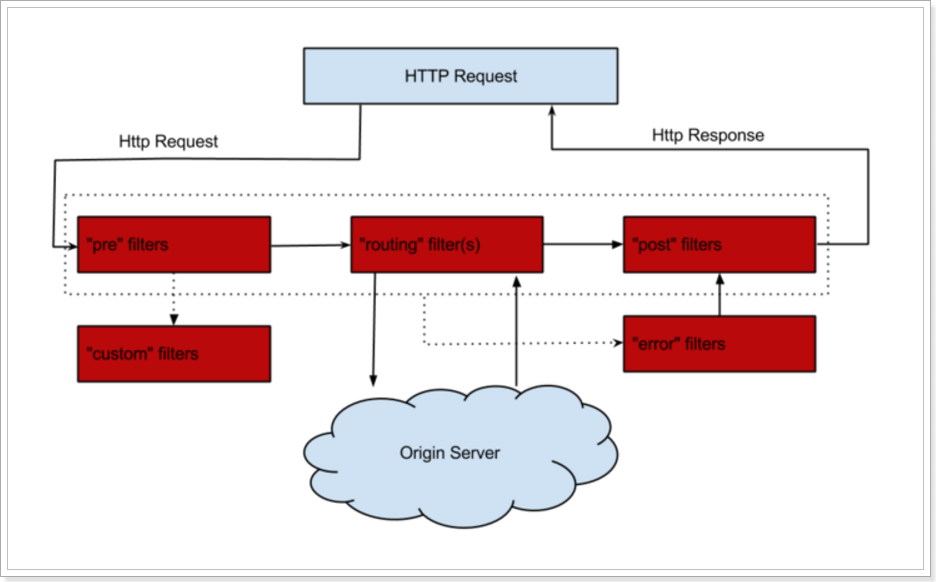

正常流程：
- 请求到达首先会经过pre类型过滤器，而后到达route类型，进行路由，请求就到达真正的服务提供者，执行请求，返回结果后，会到达post过滤器。而后返回响应。

异常流程：
- 整个过程中，pre或者route过滤器出现异常，都会直接进入error过滤器，在error处理完毕后，会将请求交给POST过滤器，最后返回给用户。
- 如果是error过滤器自己出现异常，最终也会进入POST过滤器，将最终结果返回给请求客户端。
- 如果是POST过滤器出现异常，会跳转到error过滤器，但是与pre和route不同的是，请求不会再到达POST过滤器了。

所有内置过滤器列表：

 


### 3.8.3.使用场景

场景非常多：

- 请求鉴权：一般放在pre类型，如果发现没有访问权限，直接就拦截了
- 异常处理：一般会在error类型和post类型过滤器中结合来处理。
- 服务调用时长统计：pre和post结合使用。


## 3.9.自定义过滤器

接下来我们来自定义一个过滤器，模拟一个登录的校验。基本逻辑：如果请求中有access-token参数，则认为请求有效，放行。

### 3.9.1.定义过滤器类

 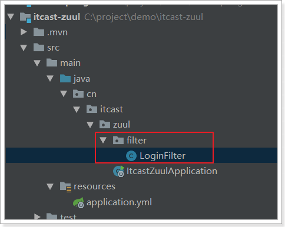

内容：

```java
@Component
public class LoginFilter extends ZuulFilter {
    /**
     * 过滤器类型，前置过滤器
     * @return
     */
    @Override
    public String filterType() {
        return "pre";
    }

    /**
     * 过滤器的执行顺序
     * @return
     */
    @Override
    public int filterOrder() {
        return 1;
    }

    /**
     * 该过滤器是否生效
     * @return
     */
    @Override
    public boolean shouldFilter() {
        return true;
    }

    /**
     * 登陆校验逻辑
     * @return
     * @throws ZuulException
     */
    @Override
    public Object run() throws ZuulException {
        // 获取zuul提供的上下文对象
        RequestContext context = RequestContext.getCurrentContext();
        // 从上下文对象中获取请求对象
        HttpServletRequest request = context.getRequest();
        // 获取token信息
        String token = request.getParameter("access-token");
        // 判断
        if (StringUtils.isBlank(token)) {
            // 过滤该请求，不对其进行路由
            context.setSendZuulResponse(false);
            // 设置响应状态码，401
            context.setResponseStatusCode(HttpStatus.SC_UNAUTHORIZED);
            // 设置响应信息
            context.setResponseBody("{\"status\":\"401\", \"text\":\"request error!\"}");
        }
        // 校验通过，把登陆信息放入上下文信息，继续向后执行
        context.set("token", token);
        return null;
    }
}
```


### 3.9.2.测试

没有token参数时，访问失败：


添加token参数后：

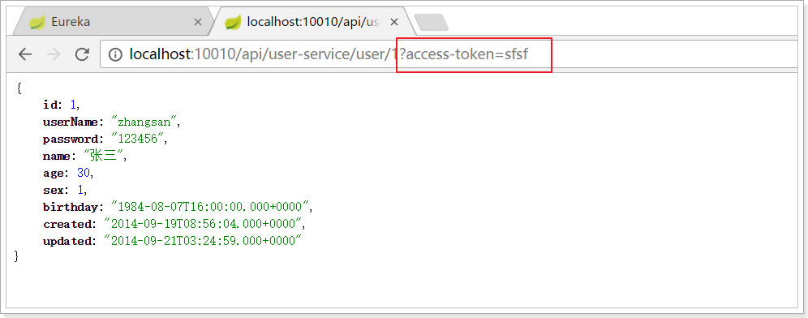


## 3.10.负载均衡和熔断

Zuul中默认就已经集成了Ribbon负载均衡和Hystix熔断机制。但是所有的超时策略都是走的默认值，比如熔断超时时间只有1S，很容易就触发了。因此建议我们手动进行配置：

```yaml
hystrix:
  command:
    default:
      execution:
        isolation:
          thread:
            timeoutInMilliseconds: 2000 # 设置hystrix的超时时间为6000ms
```

## 4.总结


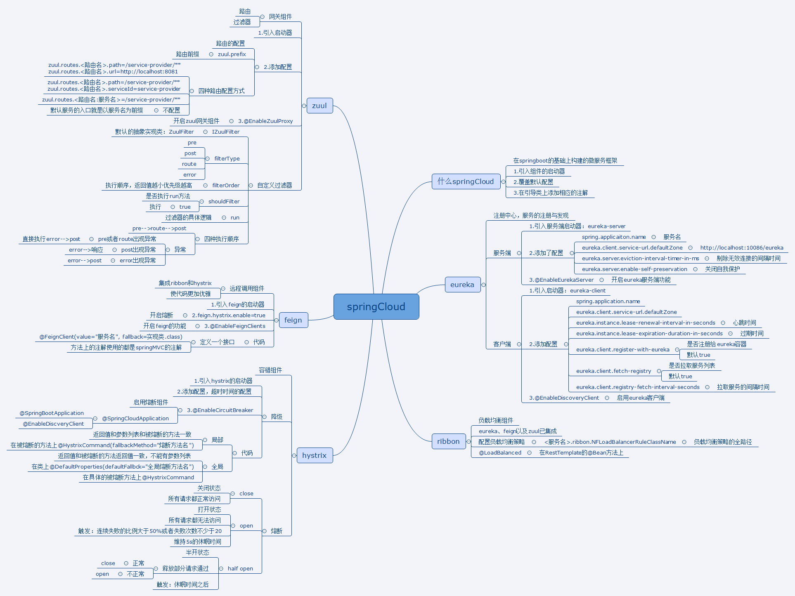